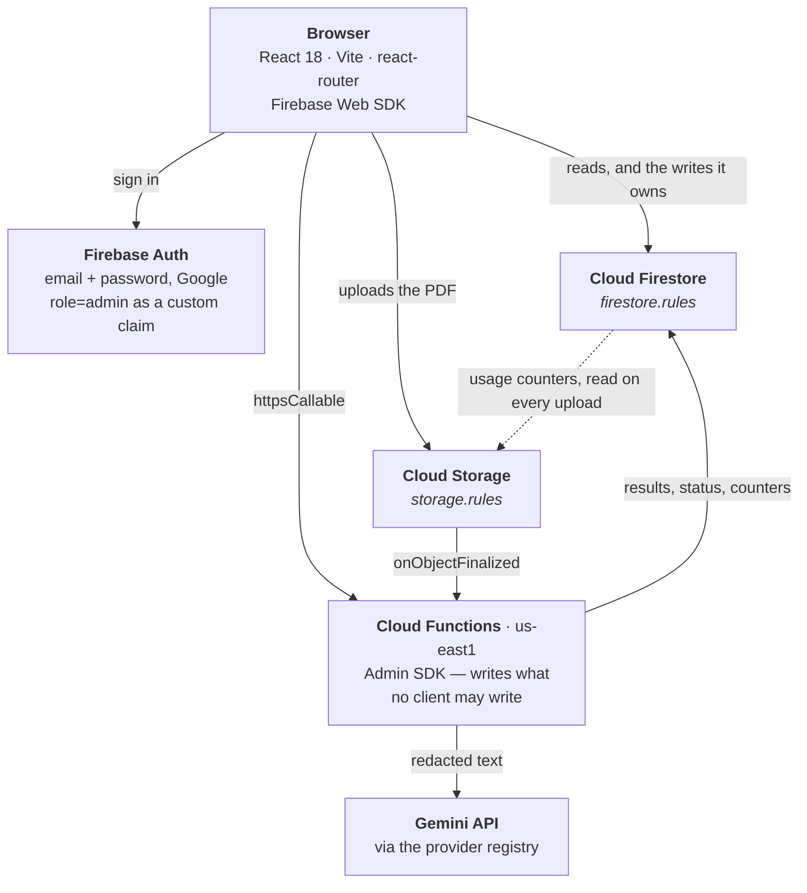

# LabResults

An AI-assisted laboratory result **organization and education** platform. Users
upload laboratory report PDFs; the system extracts every value, classifies it
against the reference range printed on that report, tracks it over time, and
explains it in plain language.

It is not a medical device, and every AI-generated statement is labelled as such.
See [the medical disclaimer](src/domain/disclaimers.ts).

React + TypeScript + Vite on Firebase (Auth, Firestore, Storage, Hosting).
Bilingual (English and Spanish) with light, dark and system themes.

## Getting started

```bash
npm install
cp .env.example .env   # then fill it in — see Environment, below
npm run dev
```

Full instructions, including the Firebase console settings that cannot be done
from the codebase, are in **[docs/setup.md](docs/setup.md)**.

## Documentation

- **[docs/setup.md](docs/setup.md)** — local development, configuration, CI/CD
- **[docs/design-system.md](docs/design-system.md)** — tokens, components, the
  accessibility baseline every page is held to
- **[docs/quotas.md](docs/quotas.md)** — capacity limits, how they are enforced,
  and the billing budget you must set up by hand
- **[docs/ai.md](docs/ai.md)** — the AI provider layer, swapping models or
  vendors, and what redaction does and does not do
- **[docs/variables.md](docs/variables.md)** — the laboratory-variable catalog:
  how a printed test name is matched to it, why it never edits itself, and how
  to import the maintained spreadsheet

## Architecture

There is no application server. The browser talks to Firebase directly, and
Cloud Functions run beside the data rather than in front of it.



**The rules files are the architecture, not a detail of it.** Because the client
speaks to the database directly, `firestore.rules` and `storage.rules` are the
only thing standing between a browser and the data. Every trust decision in this
system is expressed there: who owns a document, which fields a client may never
touch, how large a file may be, and how many uploads an account has left this
month. The dotted arrow above is real — `storage.rules` reads the usage counters
out of Firestore on every upload, which is what makes the capacity caps binding
rather than advisory.

### What happens when a report is uploaded

The order is the design, and it is documented at the top of
[`functions/src/pipeline.ts`](functions/src/pipeline.ts):

1. **The browser uploads the PDF** straight to Storage. `storage.rules` checks
   the size, the content type, the account's remaining bytes and its remaining
   monthly upload operations before a byte is stored.
2. **`onReportUploaded` fires** (`functions/src/usage.ts`), re-checks capacity
   now that the true size is known, moves the counters, and hands off.
3. **Consent is checked server-side.** Nothing leaves the process without it —
   the browser gate makes the requirement visible, this one makes it true.
4. **Text is extracted in our own process** (`pdf-parse`), so redaction can be
   applied to it before anything is sent anywhere.
5. **The model reads values off the text.** It is asked to transcribe, never to
   interpret.
6. **Classification is arithmetic, in code**, against the reference range
   printed on that same report. No model output decides whether a value is
   normal.
7. **Results are written by the Admin SDK**, into a subcollection no client can
   write.
8. **Commentary is generated** for out-of-range results only, capped per report,
   and stored with its provider, model and prompt version attached.
9. **Trends are recalculated** into `users/{uid}/variableSeries`, denormalised so
   the grid can draw two dozen cards without two dozen round trips.

### Cloud Functions

One codebase, one region. A Storage-triggered function must be co-located with
its bucket, and one region is one thing to reason about — see
`functions/src/region.ts`.

| Function | Trigger | Does |
| --- | --- | --- |
| `onReportUploaded` | Storage finalize | Capacity re-check, usage counters, then the pipeline |
| `onReportDeleted` | Storage delete | Gives the bytes and the quota back |
| `reconcileUsage` | Scheduled | Recomputes true usage from the bucket and corrects counter drift |
| `enrichCatalogBacklog` | Scheduled | Fills in missing catalog names and explanations, in bounded batches |
| `deleteAccount` | Callable | Erases reports, results, series, Storage objects and the Auth record |
| `retryReport` | Callable | The way back for a report the one-shot trigger stranded |
| `setUserRole` | Callable | Sets the `role` custom claim |
| `setUserDisabled` | Callable | Disables an account |
| `clearVariableData` | Callable | Admin catalog maintenance |
| `aiHealthCheck` | Callable | Confirms the provider is reachable and configured |

### Data model

Every collection, and who may write it. The reasoning behind each rule is in
`firestore.rules`; the TypeScript half of the same contract is
[`src/domain/types.ts`](src/domain/types.ts).

| Path | Written by | Readable by |
| --- | --- | --- |
| `users/{uid}` | The owner — name, preferences, consent, identity document, health context. `role`, `disabled` and `deletedAt` only by the server | Owner, admin |
| `users/{uid}/variableSeries/{variableId}` | The trend engine only | Owner, admin |
| `reports/{reportId}` | Owner creates it and may correct the label and the date; everything the pipeline owns is denied | Owner, admin |
| `reports/{reportId}/results/{resultId}` | The extraction pipeline only | Owner, admin |
| `usage/{uid}` | Server only | Owner, admin, and `storage.rules` |
| `systemUsage/global` | Server only | Any signed-in user — `storage.rules` consults it on every upload |
| `variables/{variableId}` | Admins and the importer. Entries are immutable once written | Any signed-in user |
| `variableCategories/{categoryId}` | Admins | Any signed-in user |
| `processingJobs/{jobId}` | Server only | Admin |
| `auditLogs/{logId}` | Server only, append-only | Admin |

Anything not matched is denied: the catch-all at the bottom of the rules file is
a deny, so a new collection stays closed until someone opens it deliberately.

### The AI layer

`getAiProvider()` in `functions/src/ai/registry.ts` is the only way to obtain a
provider anywhere in this codebase, and what it returns is always wrapped in
redaction — the raw constructors are not exported. Redaction that each caller
has to remember is redaction that will eventually be forgotten, so the promise
on the landing page is a property of the architecture rather than a convention.
Swapping provider is three edits; see [docs/ai.md](docs/ai.md).

## Tools

| | |
| --- | --- |
| **Language** | TypeScript 5.7, strict, `es2022` target |
| **Web app** | React 18, react-router 6, Vite 6 |
| **Styling** | Plain CSS with design tokens (`src/styles`), Plus Jakarta Sans, Phosphor icons |
| **Backend** | Cloud Functions v2 on Node 22, firebase-admin |
| **Data** | Cloud Firestore, Cloud Storage, Firebase Auth |
| **AI** | Google Gemini via `@google/genai`, behind a provider interface |
| **PDF** | `pdf-parse` reads the text inside the function; the browser frames the stored file from Storage rather than rendering it itself |
| **Tests** | Vitest + Testing Library (unit and component), Playwright + axe-core (end-to-end and accessibility) |
| **Static checks** | ESLint 9 flat config, `tsc --noEmit`, `npm audit`, gitleaks in CI |
| **Monitoring** | Sentry (optional), GA4 with route patterns only (optional) |
| **CI/CD** | GitHub Actions, Firebase Hosting preview channels, Dependabot |

Node 20 or later locally. CI uses 22, which is also the functions runtime.

## Environment

**`.env` at the repository root is the only environment file you edit.**
`functions/.env` and `functions/.env.local` are generated from it by
`npm run sync:env`, which `dev`, `emulators` and the functions build all run for
you. They are gitignored, and editing them directly loses the change on the next
sync. Copy [`.env.example`](.env.example) to start.

### The prefix is the security boundary

| Prefix | Reaches | |
| --- | --- | --- |
| `VITE_*` | The browser | Vite inlines these into the bundle at build time. **Public — anyone can read them.** |
| anything else | Cloud Functions only | Never enters the bundle. Credentials go here. |

`sync:env` **refuses to run** if a known secret name is found wearing a `VITE_`
prefix, because that one prefix is all that separates "server-side secret" from
"published on the next deploy".

Server variables are split again on the way out, because Firebase treats the two
files differently. `functions/.env` is *deployed* and readable by anyone with
project access, so only non-secret selection goes there; `functions/.env.local`
is emulator-only and never deployed. Deployed secrets come from neither — they
come from Secret Manager:

```bash
firebase functions:secrets:set GEMINI_API_KEY
```

### Every variable

| Variable | Default | What it is |
| --- | --- | --- |
| `VITE_FIREBASE_API_KEY` | — | Web config from the Firebase console. Public by design: it identifies the project, it does not grant access — that is what the rules files are for |
| `VITE_FIREBASE_AUTH_DOMAIN` | — | Keep the default `<project>.firebaseapp.com`. Pointing it at your Hosting domain without also adding that domain's `/__/auth/handler` to the OAuth client's redirect URIs breaks Google sign-in |
| `VITE_FIREBASE_PROJECT_ID` | — | |
| `VITE_FIREBASE_STORAGE_BUCKET` | — | |
| `VITE_FIREBASE_MESSAGING_SENDER_ID` | — | |
| `VITE_FIREBASE_APP_ID` | — | |
| `VITE_USE_FIREBASE_EMULATORS` | `true` | Routes Auth, Firestore, Storage and Functions to the local suite. Set `false` to work against the live project — and deploy the rules first, or every read and write is denied |
| `VITE_FUNCTIONS_REGION` | `us-east1` | Must match `FUNCTIONS_REGION`. A mismatch surfaces in the browser as a CORS error, which names nothing useful |
| `VITE_SENTRY_DSN` | blank | Blank disables error reporting entirely |
| `VITE_SENTRY_ENVIRONMENT` | `development` | |
| `VITE_APP_VERSION` | `dev` | CI sets the commit SHA, so an error report names a build |
| `VITE_GA_MEASUREMENT_ID` | blank | GA4 id. Blank disables analytics completely — no script fetched, no request made, which is how local development and the test suite run. What is sent is deliberately narrow: route *patterns* (`/variables/:variableId`, never `/variables/hemoglobin`), no user id, no advertising signals. The header of `src/lib/analytics.ts` explains why that is not optional in an app whose URLs name laboratory tests |
| `AI_PROVIDER` | `gemini` | Selects the provider in the registry |
| `GEMINI_MODEL` | `gemini-2.5-flash` | |
| `GEMINI_BILLING_ENABLED` | `false` | Set true **only** after enabling billing on the Gemini project. On the free tier Google's terms allow submitted content to be used to improve their products; leaving this false makes the app report that truthfully in the metadata attached to every AI statement |
| `AI_MAX_OUTPUT_TOKENS` | `2048` | |
| `AI_TEMPERATURE` | `0` | |
| `AI_TIMEOUT_MS` | `30000` | |
| `AI_MAX_RETRIES` | `2` | |
| `GEMINI_API_KEY` | — | **Secret.** Local and emulator only; deployed functions read it from Secret Manager |

`src/lib/env.ts` validates the `VITE_FIREBASE_*` values at startup and fails with
one message naming everything missing, rather than letting `undefined` disappear
into the Firebase SDK.

Capacity limits and the retry policy are deliberately *not* environment
variables: they live in `config/quotas.json` and `config/retry.json`, which the
web app, the functions and a drift test against the rules files all read. A
limit that can differ between environments is a limit that eventually will.

## Layout

```
src/
  auth/         Session, role and route guards
  components/   The component library (KAN-39)
  domain/       Types, status tables and regulated copy — no React
  hooks/        Cross-page state: locale, AI consent, storage quota, page views
  i18n/         Message catalogs, the provider, and per-locale formatting
  layouts/      Public, auth-split and authenticated shells
  lib/          Firebase, environment and monitoring plumbing
  pages/        Screens, grouped by who can reach them (pages/app/admin needs
                the admin role)
  services/     Firestore and Storage access
  styles/       Broadsheet base, LabResults theme, app layout
  test/         Render helpers, the axe harness and the Vitest setup
  theme/        Light/dark/system preference, resolved and persisted
firestore.rules storage.rules   The real security boundary
config/quotas.json              Every capacity limit, in one place
config/retry.json               When a failed report may be processed again
config/csp.mjs                  One Content-Security-Policy for dev, preview
                                and hosting
seeds/                          What a fresh project's reference collections
                                start with, and the only place variable data
                                or category definitions are written down:
                                categories.json (the grid's panels),
                                variables.json (the catalog, as imported from
                                the maintained spreadsheet) and
                                variable-review.json (curation decisions
                                applied to it). Read by the seeding scripts,
                                never at runtime — Firestore is the source of
                                truth once seeded.
functions/src/                  Cloud Functions: the extraction pipeline, usage
                                accounting, roles, account deletion, retries
                                and trend analysis
functions/src/ai/               The provider registry, prompts and redaction
functions/src/variables/        Catalog matching, enrichment and the sweep
functions/scripts/              Catalog import, curation, merges and backfill
                                (docs/variables.md)
e2e/                            Playwright specs, run against a real build
scripts/sync-env.mjs            Fans the root .env out to the functions package
```

Tests live in a `tests/` directory beside the code they cover, and the app
imports through the `@/` alias rather than by relative path.

## Commands

| Command | Does |
| --- | --- |
| `npm run dev` | Dev server, with the relaxed CSP that HMR needs |
| `npm run build` | Production build |
| `npm run preview` | Serves the real build under the **strict** CSP, byte-identical to what Hosting sends. Run it before shipping — a CSP violation surfaces here instead of after a deploy |
| `npm run emulators` | The Firebase emulator suite (UI on :4000) |
| `npm test` | Unit and component tests |
| `npm run test:coverage` | The same, with coverage |
| `npm run test:functions` | Build and test the Cloud Functions package |
| `npm run build:functions` | Compile the Cloud Functions package |
| `npm run e2e` | Playwright against a production build, including the axe pass |
| `npm run lint` / `npm run typecheck` | Static checks |
| `npm run audit:deps` | Dependency audit; `high` and above fails |
| `npm run sync:env` | Regenerate `functions/.env*` from the root `.env` |

`npm run e2e` needs browsers once: `npx playwright install chromium`.

## CI/CD

`.github/workflows/ci.yml` runs five jobs: `verify` (lint, typecheck, unit tests
with coverage, build), `e2e` (Playwright on desktop and mobile, with axe),
`security` (`npm audit` at `high`, gitleaks over the history), `preview` (a
Hosting preview channel per PR, pointed at **staging**, never production), and
`deploy` on a green push to `main`.

The deploy is a single `firebase deploy`, and the order is not optional: rules
first, so the security and quota gates are in force before anything can reach
them; functions next, so the counters those rules read are being written;
hosting last, so nobody sees a UI whose backend has not moved with it.

Required repository secrets, branch protection and the IAM notes are in
[docs/setup.md](docs/setup.md).

## Three rules worth knowing before you write code

**Status is never colour alone.** Every status carries an icon and a text label
from `domain/status.ts`. See the design-system doc.

**The client never writes what the pipeline owns.** Extracted results,
classifications, processing state and audit records are written by the Admin SDK
only. `firestore.rules` denies them from the browser, which is what makes the
extracted data trustworthy.

**Everything runs inside the free tier.** 400 MiB per user, 4 GiB in total,
enforced in `storage.rules` against counters that Cloud Functions maintain. All
the numbers live in one file, `config/quotas.json`. See
[docs/quotas.md](docs/quotas.md) — and note that upload *operations*, not
stored bytes, are what actually binds.

## What is built

**Public** — landing, the legal pages, and the full authentication flow:
sign-in, registration, password reset and email verification.

**The app** — uploading a report and watching it process; the report list and a
detail page for each; the laboratory-variable grid at `/variables`, which is the
home screen, a page per variable with its history, reference band and zoom; and
account settings, where the AI consent gate lives.

**The profile** — the account name and email; an identity document (cédula de
ciudadanía, registro civil, pasaporte or cédula de extranjería, with its number
and place of issue); an optional record about the person the results belong to —
date of birth, biological sex, pregnancy status, weight and height, medications,
ongoing conditions and symptoms, and the illnesses that run in the family; and,
last, account deletion.

Body mass index is shown beside the two measurements and is computed on read,
never stored: it is `weight / height²` and nothing else, so a stored copy is a
third number that can disagree with the two it came from. It carries a red,
amber or green signal for the WHO band it falls in, and two rules travel with
that signal — the band's **name** and icon are always beside the colour, the
way `domain/status.ts` requires of every status in this app; and every screen
that shows a band says the four bands are an **adult** scale, because under
eighteen the index is read against age-and-sex percentile charts instead. The
profile prints the whole published table under the figure, so the light can be
checked rather than believed. See `domain/bmi.ts`.

Every field in those two records is optional, each record can be deleted on its
own, and neither is read by the AI analysis yet — sending them would go beyond
what the AI-processing consent describes today, so that text has to change
first. The interface says so where the form is.

**Administration** — an overview, account management, and the variable-catalog
review queue. The job dashboard is still a placeholder naming the ticket that
builds it.

**The pipeline** — extraction, classification against the range printed on the
report, duplicate detection, usage accounting and quota enforcement, retries,
trend analysis, matching each printed name to the catalog, catalog enrichment,
and AI analysis behind an explicit consent gate.
